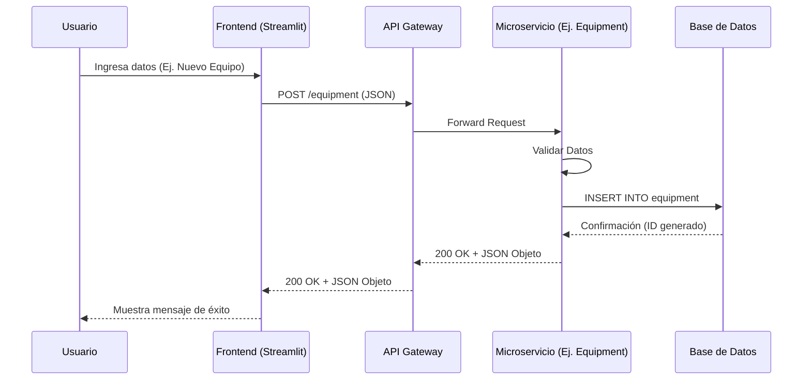
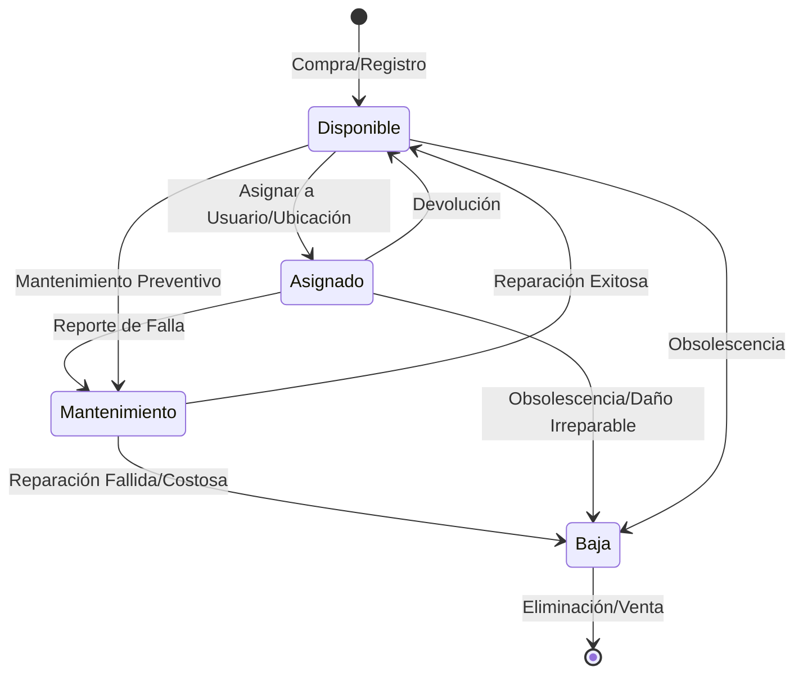
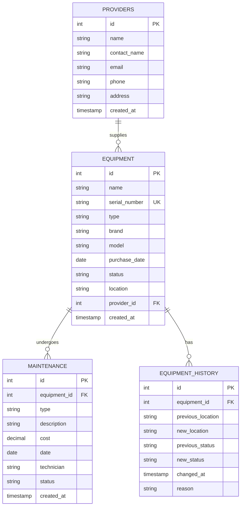

# Diagramas del Sistema de Inventario IT

## 1. Diagrama de Arquitectura
Este diagrama muestra la estructura de microservicios contenerizados del sistema.

```mermaid
graph TD
    subgraph "Cliente"
        Browser[Navegador Web]
    end

    subgraph "Docker Host"
        subgraph "Frontend Container"
            Streamlit[Streamlit App\n(Puerto 8501)]
        end

        subgraph "Backend Network"
            Gateway[API Gateway\n(FastAPI - Puerto 8000)]
            
            subgraph "Microservicios"
                Prov[Providers Service]
                Equip[Equipment Service]
                Maint[Maintenance Service]
                Rep[Reports Service]
            end
            
            DB[(PostgreSQL Database\nPuerto 5432)]
        end
    end

    Browser -->|HTTP| Streamlit
    Streamlit -->|HTTP/REST| Gateway
    Gateway -->|Route /providers| Prov
    Gateway -->|Route /equipment| Equip
    Gateway -->|Route /maintenance| Maint
    Gateway -->|Route /reports| Rep

    Prov -->|SQL| DB
    Equip -->|SQL| DB
    Maint -->|SQL| DB
    Rep -->|SQL| DB
```

## 2. Diagrama de Flujo de Datos e Iteraciones

### Flujo de Datos General
Cómo viaja la información desde el usuario hasta la persistencia.



### Iteraciones (Ciclo de Vida del Equipo)
Este diagrama de estado muestra las iteraciones o estados por los que pasa un equipo en el sistema.



## 3. Diagrama de Modelo de Datos (Entidad-Relación)


